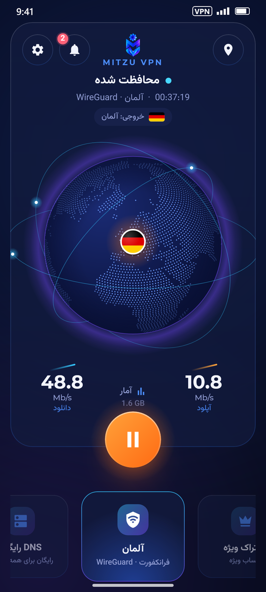
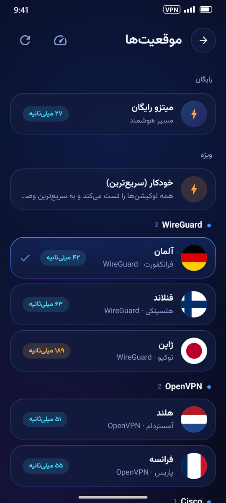
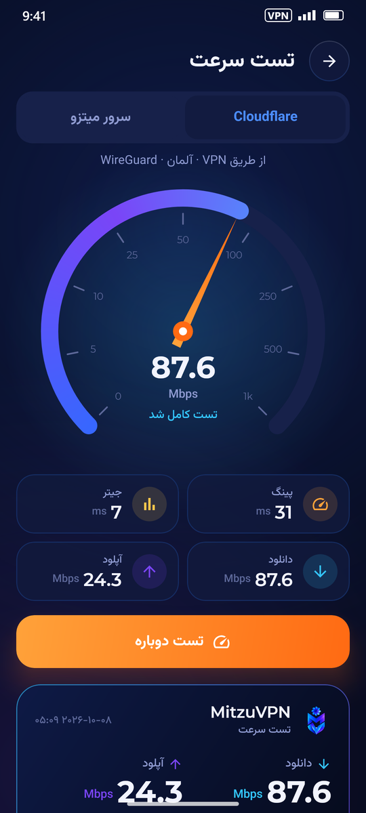
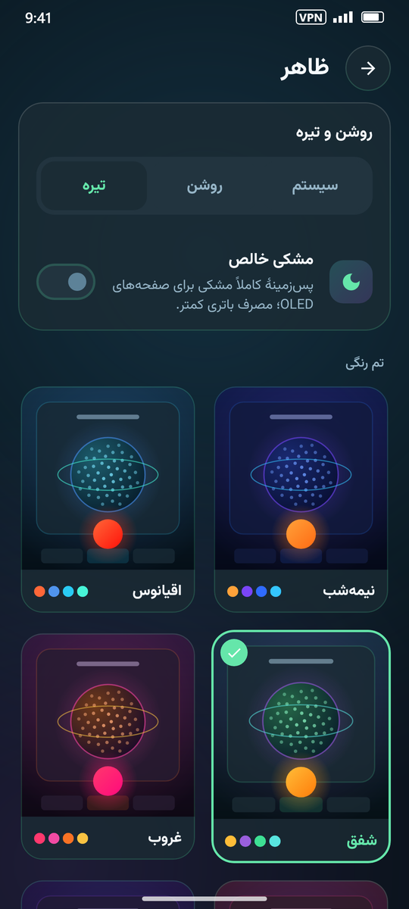
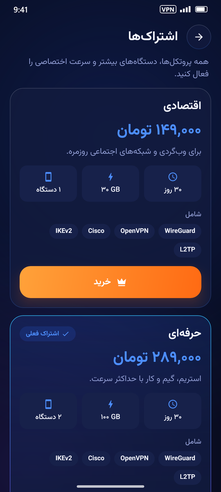
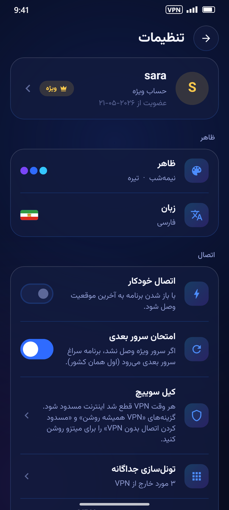
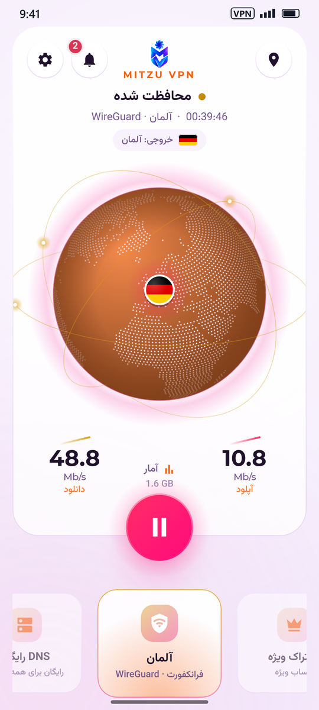
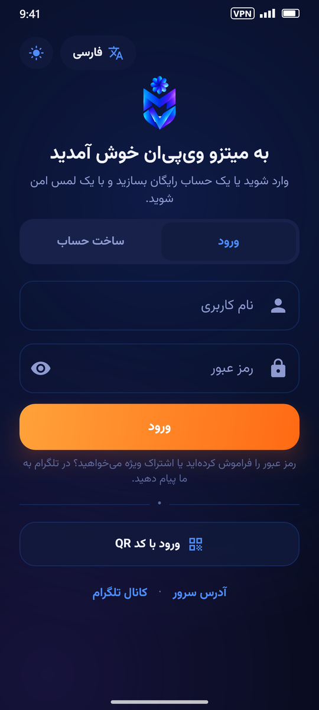
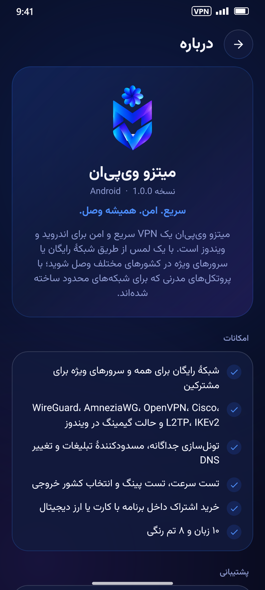
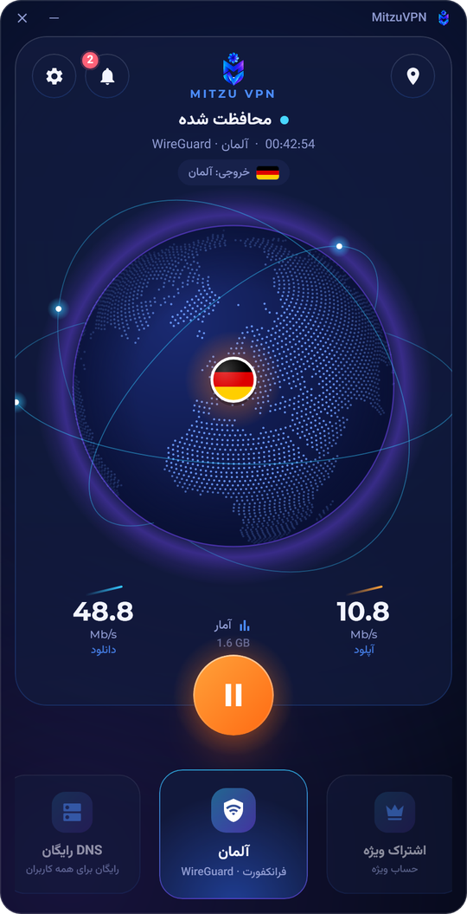

# میتزو وی‌پی‌ان · MitzuVPN

**سریع. امن. همیشه وصل.**

وی‌پی‌ان یک‌لمسی برای **اندروید** و **ویندوز**، ساخته‌شده برای اینترنت‌هایی که بقیه در آن کار نمی‌کنند.

[**دانلود آخرین نسخه**](../../releases/latest) &nbsp;·&nbsp; [English](README.md) &nbsp;·&nbsp; [تلگرام](https://t.me/MitzuVPN) &nbsp;·&nbsp; [mitzuui.com](https://mitzuui.com)

   

---

## فهرست

- [امکانات](#امکانات)
- [دانلود](#دانلود)
- [نصب روی اندروید](#نصب-روی-اندروید)
- [نصب روی ویندوز](#نصب-روی-ویندوز)
- [افزونهٔ مرورگر](#افزونهٔ-مرورگر)
- [آیفون و برنامه‌های دیگر](#آیفون-و-برنامههای-دیگر)
- [شروع کار](#شروع-کار)
- [رایگان و ویژه](#رایگان-و-ویژه)
- [داخل برنامه](#داخل-برنامه)
- [سؤالات رایج](#سؤالات-رایج)
- [پشتیبانی](#پشتیبانی)

---

## امکانات

| | |
|---|---|
| 🌍 **شبکهٔ رایگان برای همه** | بدون هیچ تنظیمی رایگان وصل شوید. حالت **هوشمند** بهترین روش اتصال را برای اینترنت شما پیدا می‌کند و به خاطر می‌سپارد. |
| ⭐ **سرورهای ویژه** | کشورهای مختلف، حالت **خودکار (سریع‌ترین)** که از همهٔ سرورها پینگ می‌گیرد و بهترین را انتخاب می‌کند، و سرورهای مخصوص **ترید**. |
| 🛡️ **پروتکل‌های مدرن** | WireGuard، AmneziaWG، OpenVPN، Cisco، L2TP و IKEv2 و **حالت گیمینگ** در ویندوز. |
| 🔀 **تونل‌سازی جداگانه** | سایت‌ها، آی‌پی‌ها و برنامه‌هایی (اندروید) یا نرم‌افزارهایی (ویندوز) که نباید از VPN عبور کنند. |
| 🛡️ **محافظت** | تبلیغات، ردیاب‌ها، بدافزار و فیشینگ را مسدود می‌کند؛ یا حالت **خانواده** که سایت‌های بزرگسالان را هم می‌بندد. |
| 🇮🇷 **سایت‌های ایرانی بدون VPN** | سایت‌ها و سرویس‌های ایرانی مستقیم باز می‌شوند؛ سریع‌تر، و بانک و درگاه پرداخت هم کار می‌کنند. |
| 🏠 **شبکهٔ محلی** | پرینتر، تلویزیون و پخش روی تلویزیون هنگام اتصال کار می‌کنند. |
| 🧯 **کیل سوییچ** | در ویندوز هیچ ترافیکی بیرون از VPN نمی‌رود، حتی اگر اتصال قطع شود. در اندروید از گزینهٔ *Always-on VPN* سیستم استفاده کنید. |
| 🔁 **بدون گیر کردن** | اگر سرور ویژه جواب ندهد، برنامه خودش سرور بعدی را امتحان می‌کند. |
| ⭐ **علاقه‌مندی‌ها و ویجت** | سرورها را ستاره بزنید و از ویجت صفحهٔ اصلی یا میان‌بُر آیکون (اندروید) وصل شوید. |
| ⏰ **یادآوری تمدید** | چند روز قبل از پایان اشتراک خبرتان می‌کند؛ با یک لمس تمدید کنید. |
| 🧭 **DNS رایگان** | DNSهای آماده با نمایش پینگ، رایگان برای همه. |
| ⚡ **تست سرعت** | دانلود، آپلود، پینگ و جیتر، با VPN یا بدون آن — و اشتراک‌گذاری نتیجه به‌صورت تصویر. |
| 🎨 **۸ تم رنگی** | نیمه‌شب، اقیانوس، شفق، غروب، رز، سلطنتی، اخگر و گرافیت؛ روشن، تیره یا **مشکی خالص**. |
| 🗣️ **۱۰ زبان** | فارسی، دری، پشتو، English، Türkçe، العربية، Русский، Тоҷикӣ، Türkmen، 中文 |
| 💳 **خرید داخل برنامه** | پرداخت کارت به کارت یا ارز دیجیتال؛ اشتراک خودکار فعال می‌شود. |
| 💬 **پشتیبانی داخل برنامه** | تیکت پشتیبانی و صندوق پیام برای اخبار، داخل خود برنامه. |
| 🔔 **به‌روزرسانی** | برنامه انتشار نسخهٔ جدید را به شما خبر می‌دهد. |
| 🧩 **افزونهٔ مرورگر** | حساب‌های ویژه می‌توانند کروم، اج، اپرا، بریو یا ویوالدی را با یک لمس و بدون نصب برنامه محافظت کنند. |

   

---

## دانلود

فایل‌ها را از [**آخرین نسخه (Releases)**](../../releases/latest) دریافت کنید:

| دستگاه | فایل | نیازمندی |
|---|---|---|
| **اندروید** (همهٔ گوشی‌ها) | `MitzuVPN-x.y.z-universal.apk` | اندروید ۷ یا جدیدتر |
| اندروید، گوشی‌های جدید (حجم کمتر) | `MitzuVPN-x.y.z-arm64-v8a.apk` | گوشی‌های ۶۴ بیتی (تقریباً همهٔ گوشی‌ها از ۲۰۱۷ به بعد) |
| اندروید، گوشی‌های قدیمی | `MitzuVPN-x.y.z-armeabi-v7a.apk` | گوشی‌های ۳۲ بیتی |
| اندروید روی کامپیوتر / کروم‌بوک | `MitzuVPN-x.y.z-x86_64.apk` | شبیه‌سازها و کروم‌بوک |
| **ویندوز** | `MitzuVPN-Setup-x.y.z.exe` | ویندوز ۱۰ یا ۱۱، ۶۴ بیتی |
| **مرورگر** (حساب ویژه) | `MitzuVPN-x.y.z-chromium.zip` | کروم، اج، اپرا، بریو یا ویوالدی روی کامپیوتر |

> مطمئن نیستید کدام فایل اندروید را بگیرید؟ **universal** را بگیرید؛ روی همهٔ گوشی‌ها نصب می‌شود.

میتزو را فقط از همین صفحه یا کانال تلگرام [@MitzuVPN](https://t.me/MitzuVPN) دانلود کنید. فایل `SHA256SUMS.txt` در صفحهٔ هر نسخه برای بررسی سالم بودن فایل‌ها است.

---

## نصب روی اندروید

۱. فایل APK را روی گوشی دانلود و باز کنید (از اعلان دانلود یا پوشهٔ **Downloads**).

۲. اگر اندروید پرسید، به مرورگر یا فایل‌منیجر اجازهٔ **نصب برنامه‌های ناشناس** (Install unknown apps) بدهید، برگردید و **نصب** را بزنید.

۳. **اگر Google Play Protect هشدار داد** (چون میتزو از خارج گوگل‌پلی نصب می‌شود، Play Protect هنوز آن را نمی‌شناسد):
   - **«Unsafe app blocked»** ← روی **More details** (جزئیات بیشتر) و سپس **Install anyway** (در هر صورت نصب شود) بزنید.
   - **«Send app for a security check?»** ← **Send** (یا **Scan app**) را بزنید. این کار به گوگل کمک می‌کند بفهمد میتزو امن است و نصب ادامه پیدا می‌کند.
   - اگر دکمهٔ **Install anyway** نبود: **Google Play Store ← عکس پروفایل ← Play Protect ← ⚙️** و گزینهٔ **Scan apps with Play Protect** را موقتاً خاموش کنید، میتزو را نصب کنید و **دوباره روشنش کنید**.

۴. **گوشی‌های سامسونگ:** اگر نصب با پیام *Auto Blocker* رد شد، به **Settings ← Security and privacy ← Auto Blocker** بروید، خاموشش کنید، نصب کنید و دوباره روشنش کنید.

۵. میتزو را باز کنید. بار اول که وصل می‌شوید، اندروید اجازهٔ **اتصال VPN** را می‌پرسد؛ **OK** را بزنید.

**برای اتصال پایدار**

- وقتی پرسید، اجازهٔ اعلان‌ها را بدهید (اندروید ۱۳ به بعد)؛ وضعیت اتصال در اعلان نمایش داده می‌شود.
- **تنظیمات گوشی ← برنامه‌ها ← MitzuVPN ← باتری ← بدون محدودیت (Unrestricted)** تا اندروید VPN را در پس‌زمینه نبندد (در شیائومی **Autostart** را هم روشن کنید).

**به‌روزرسانی:** APK جدید را روی نسخهٔ قبلی نصب کنید؛ حساب و تنظیمات شما می‌ماند.

---

## نصب روی ویندوز

۱. `MitzuVPN-Setup-x.y.z.exe` را دانلود و اجرا کنید.

۲. اگر پیام **«Windows protected your PC»** آمد، روی **More info** و سپس **Run anyway** بزنید.

۳. به نصب‌کننده اجازهٔ تغییرات بدهید (دسترسی Administrator)؛ سرویس VPN و درایور شبکهٔ موردنیاز میتزو نصب می‌شود.

۴. میتزو را از منوی Start یا دسکتاپ باز کنید. آیکون آن کنار ساعت ویندوز (System tray) هم هست.

**به‌روزرسانی:** نصب‌کنندهٔ جدید را اجرا کنید؛ نسخهٔ قبلی جایگزین و تنظیمات حفظ می‌شود.
**حذف:** **Settings ← Apps ← MitzuVPN ← Uninstall**.

---

## افزونهٔ مرورگر

حساب‌های ویژه می‌توانند بدون نصب برنامه، مرورگر خود را محافظت کنند. فقط همان مرورگر از میتزو عبور می‌کند و برنامه‌های دیگر کامپیوتر نه.

۱. `MitzuVPN-x.y.z-chromium.zip` را دانلود کنید و در پوشه‌ای که نگه می‌دارید **از حالت فشرده خارج کنید** (مثلاً *Documents\MitzuVPN-browser*). این پوشه را بعداً پاک نکنید؛ مرورگر افزونه را از همان‌جا اجرا می‌کند.

۲. صفحهٔ افزونه‌ها را باز کنید: `chrome://extensions` (کروم، بریو، ویوالدی)، `edge://extensions` (اج) یا `opera://extensions` (اپرا).

۳. **Developer mode** را روشن کنید (بالا سمت راست؛ در اج در منوی سمت چپ).

۴. روی **Load unpacked** بزنید و پوشهٔ استخراج‌شده (همان که `manifest.json` داخلش است) را انتخاب کنید.

۵. روی آیکون پازل در نوار ابزار بزنید و میتزو را **سنجاق (Pin)** کنید. بازش کنید و با نام کاربری و رمز، یا با QR ورود وارد شوید: عکس QR را کپی کنید و در پنجرهٔ ورود **Ctrl+V** بزنید (یا **ورود با کد QR ← انتخاب تصویر QR**).

با یک لمس وصل می‌شوید. **موقعیت‌ها** سرورهای شما را با پینگ و گزینهٔ **خودکار (سریع‌ترین)** نشان می‌دهد. در **تنظیمات**: کیل سوییچ، محافظت WebRTC (آی‌پی واقعی شما را از تماس تصویری و بازی‌ها پنهان می‌کند)، سایت‌های ایرانی بدون VPN، دسترسی به شبکهٔ محلی و سایت‌هایی که خودتان می‌خواهید مستقیم باز شوند. هنگام اتصال، آیکون نوار ابزار کشور را نشان می‌دهد.

**به‌روزرسانی:** نسخهٔ جدید را در همان پوشه استخراج کنید و در صفحهٔ افزونه‌ها روی ↻ کارت میتزو بزنید.
**حذف:** دکمهٔ **Remove** روی همان کارت.

---

## آیفون و برنامه‌های دیگر

حساب‌های ویژه **لینک اشتراک (ساب)** دارند. در میتزو به **حساب کاربری ← لینک اشتراک (ساب)** بروید (یا از فروشنده بگیرید)، کپی کنید و در هر برنامهٔ VPN آیفون که لینک ساب قبول می‌کند (مثلاً *V2Box* یا *Streisand*) اضافه کنید. سرورهای شما آنجا می‌آیند و به‌روز می‌مانند.

---

## شروع کار

۱. **زبان** را انتخاب کنید.

۲. با نام کاربری و رمزی که فروشنده داده **وارد شوید**، یا **کد QR** او را اسکن کنید — یا **حساب رایگان بسازید**.

۳. **دکمهٔ بزرگ اتصال** را بزنید. وقتی پرچم کشور روی کرهٔ زمین آمد، محافظت می‌شوید.

۴. برای انتخاب سرور یا کشور، دکمهٔ **📍 موقعیت** بالای صفحه را بزنید.

با **حساب کاربری ← ورود دومرحله‌ای** امنیت حساب را بالا ببرید و در **حساب کاربری ← دستگاه‌های واردشده** دستگاه‌ها را ببینید یا خارج کنید.

 

---

## رایگان و ویژه

| | رایگان | ویژه |
|---|:---:|:---:|
| شبکهٔ رایگان با اتصال هوشمند | ✅ | ✅ |
| DNS رایگان، مسدودکنندهٔ تبلیغات، تست سرعت، تم‌ها | ✅ | ✅ |
| انتخاب کشور خروجی شبکهٔ رایگان | ✅ *(در صورت فعال بودن)* | ✅ |
| سرورهای ویژه در کشورهای مختلف | — | ✅ |
| **خودکار (سریع‌ترین)** و سرورهای **ترید** | — | ✅ |
| لینک ساب برای آیفون و برنامه‌های دیگر | — | ✅ |
| دستگاه‌های بیشتر برای هر حساب | — | ✅ |

**خرید اشتراک ویژه** از تب **اشتراک‌ها**: پلن را انتخاب کنید و با **کارت به کارت** (رسید را داخل برنامه بفرستید) یا **ارز دیجیتال** (برنامه آدرس، مبلغ و کد QR را نشان می‌دهد) پرداخت کنید. بعد از تأیید پرداخت، اشتراک خودکار فعال می‌شود.

---

## داخل برنامه

**⚡ تست سرعت** — *تنظیمات ← ابزارها ← تست سرعت* یا کارت صفحهٔ اصلی. با Cloudflare یا سرور میتزو، با VPN یا بدون آن اندازه بگیرید. با **اشتراک‌گذاری** نتیجه را به‌صورت تصویر بفرستید (اندروید) یا در *Pictures › MitzuVPN* ذخیره کنید (ویندوز). تست‌های اخیر در فهرست می‌مانند.

**🎨 ظاهر** — *تنظیمات ← ظاهر*: روشن، تیره یا هماهنگ با سیستم؛ **مشکی خالص** برای صفحه‌های OLED؛ و هشت تم رنگی. رنگ‌ها هنگام انتخاب نرم عوض می‌شوند.

**🔀 تونل‌سازی جداگانه** — *تنظیمات ← تونل‌سازی جداگانه*: سایت‌ها (مثل `mybank.ir`)، آی‌پی‌ها و برنامه‌ها (اندروید) یا نرم‌افزارهایی (ویندوز) که باید با اینترنت عادی کار کنند.

**🛡️ محافظت** — *تنظیمات ← محافظت*: **خاموش**، **تبلیغات** (تبلیغ، ردیاب، بدافزار و فیشینگ) یا **خانواده** (به‌علاوهٔ سایت‌های بزرگسالان و جستجوی امن). **🧭 DNS رایگان** — از صفحهٔ اصلی یک DNS با پینگ زنده انتخاب کنید.

**🇮🇷 سایت‌های ایرانی بدون VPN** — *تنظیمات* یا *تونل‌سازی جداگانه*: همهٔ سایت‌های `.ir`، سرویس‌های معروف ایرانی و آدرس‌های IP ایران مستقیم باز می‌شوند؛ سایت‌های داخلی سریع می‌مانند و بانک، درگاه پرداخت و سایت‌های دولتی کار می‌کنند.

**🏠 دسترسی به شبکهٔ محلی** — *تنظیمات*: پرینتر، تلویزیون، پخش روی تلویزیون و پوشه‌های اشتراکی هنگام اتصال در دسترس می‌مانند.

**🧯 کیل سوییچ** — *تنظیمات ← کیل سوییچ*. ویندوز: یک کلید در خود برنامه؛ همهٔ ترافیک بیرون از VPN بسته می‌شود و اگر اتصال قطع شود اینترنت تا اتصال دوباره یا زدن دکمهٔ قطع بسته می‌ماند. اندروید: تنظیمات *Always-on VPN* و *Block connections without VPN* سیستم را باز می‌کند.

**🔁 امتحان سرور بعدی** — به‌طور پیش‌فرض روشن: اگر سرور ویژه وصل نشد، برنامه سراغ سرور بعدی می‌رود (اول همان کشور).

**⭐ علاقه‌مندی‌ها، ویجت و میان‌بُرها** — با ستارهٔ کنار هر سرور، آن را بالای *موقعیت‌ها* نگه دارید. در اندروید ویجت میتزو را به صفحهٔ اصلی اضافه کنید یا آیکون برنامه را نگه دارید تا *اتصال*، *موقعیت‌ها* و *تست سرعت* ظاهر شوند.

**🎮 گیمینگ (ویندوز)** — سرورهایی که برچسب **گیمینگ** دارند از طریق WireSock وصل می‌شوند (برنامه بار اول خودش نصبش می‌کند) و می‌توانند فقط بازی‌ها را از VPN عبور دهند تا کمترین پینگ را داشته باشید.

**ℹ️ درباره** — *تنظیمات ← درباره*: نسخه، امکانات، راه‌های ارتباطی، قوانین استفاده و مجوزهای متن‌باز.

   

---

## سؤالات رایج

<b>میتزو امن است؟ چرا Play Protect هشدار می‌دهد؟</b>

Play Protect برای برنامه‌هایی که قبلاً از گوگل‌پلی ندیده هشدار می‌دهد، نه به این دلیل که چیز مضری پیدا کرده باشد. میتزو پیام‌ها، مخاطبین یا فایل‌های شما را نمی‌خواند و چنین مجوزی هم نمی‌خواهد. فقط از همین صفحه یا کانال تلگرام ما دانلود کنید.

<b>وصل نمی‌شود. چه کار کنم؟</b>

- شبکهٔ رایگان: در **موقعیت‌ها ← Mitzu Free ← روش اتصال** گزینهٔ **دستی** را بزنید و روش دیگری را امتحان کنید، یا کشور خروجی دیگری انتخاب کنید.
- اشتراک ویژه: **خودکار (سریع‌ترین)** یا پروتکل دیگری (WireGuard، AmneziaWG، OpenVPN یا Cisco) را از فهرست موقعیت‌ها امتحان کنید.
- برنامه‌های VPN یا پروکسی دیگر را ببندید؛ در ویندوز مطمئن شوید آنتی‌ویروس میتزو را مسدود نکرده.
- باز هم نشد؟ از **تنظیمات ← تیکت‌های پشتیبانی** برای ما بنویسید که چه می‌بینید.

<b>می‌گوید حسابم روی دستگاه دیگری باز است.</b>

هر اشتراک تعداد مشخصی دستگاه دارد. برنامه می‌پرسد دستگاه دیگر خارج شود یا نه؛ در **حساب کاربری ← دستگاه‌های واردشده** هم می‌توانید دستگاه‌ها را مدیریت کنید.

<b>وقتی صفحه خاموش می‌شود اتصال قطع می‌شود (اندروید).</b>

باتری میتزو را روی **بدون محدودیت** بگذارید (و در شیائومی **Autostart** را روشن کنید) و اعلان میتزو را خاموش نکنید.

<b>کدام فایل اندروید را دانلود کنم؟</b>

**universal** روی همهٔ گوشی‌ها نصب می‌شود. **arm64-v8a** حجم کمتری دارد و برای تقریباً همهٔ گوشی‌های چند سال اخیر مناسب است.

<b>چطور تمدید یا ارتقا بدهم؟</b>

از تب **اشتراک‌ها** دوباره خرید کنید؛ روزها و حجم به حساب شما اضافه می‌شود.

---

## پشتیبانی

- کانال و پشتیبانی تلگرام: [**@MitzuVPN**](https://t.me/MitzuVPN)
- وب‌سایت: [**mitzuui.com**](https://mitzuui.com)
- داخل برنامه: **تنظیمات ← تیکت‌های پشتیبانی**

استفاده از میتزو به معنی پذیرش قوانین استفادهٔ آن است که در برنامه در **تنظیمات ← درباره ← قوانین استفاده** آمده است.

© MitzuVPN

