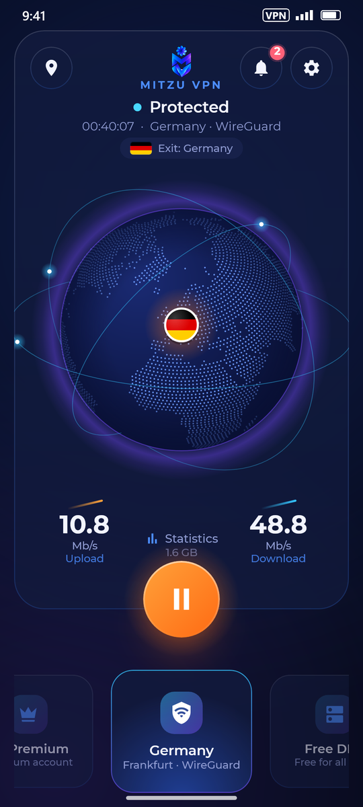
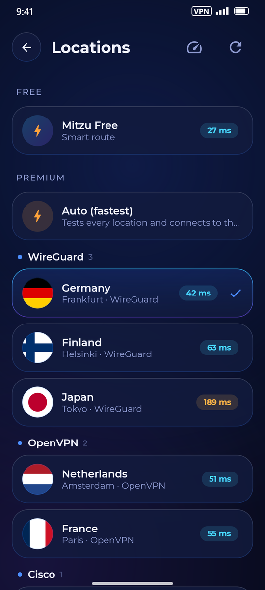
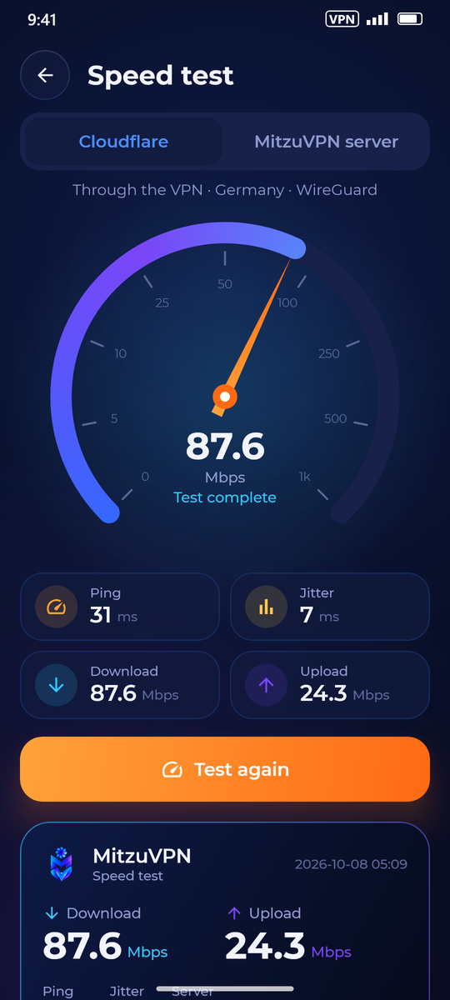
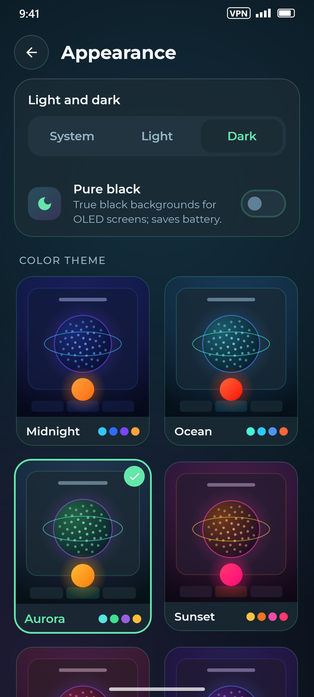
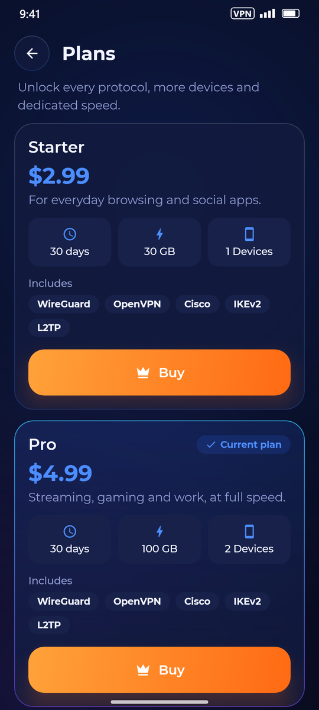
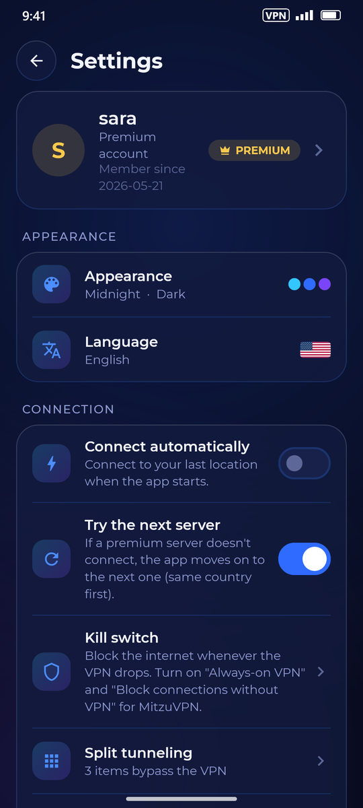
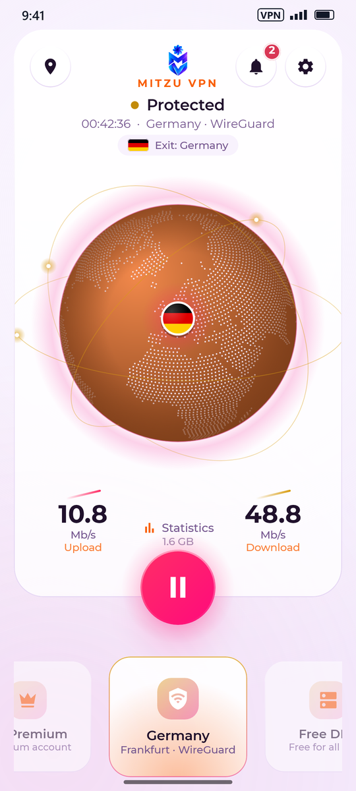
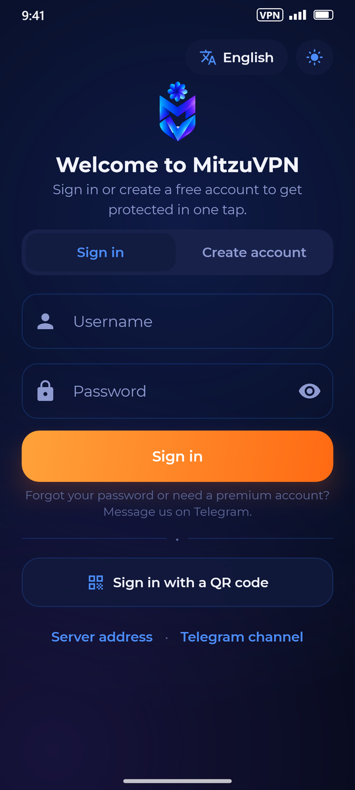
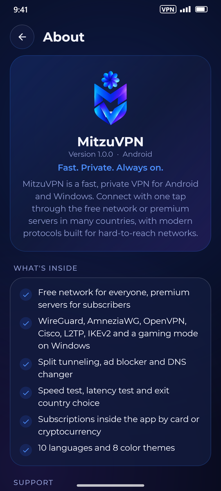
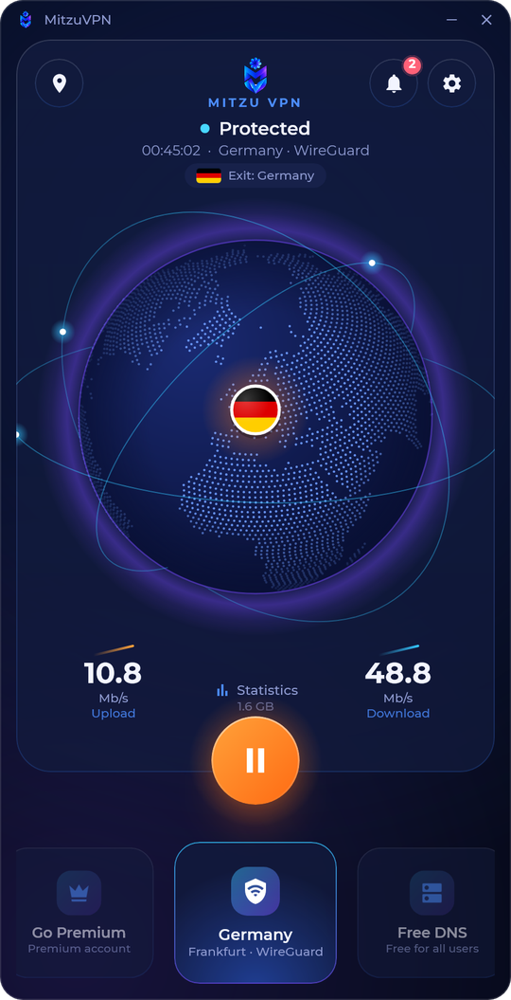

# MitzuVPN

**Fast. Private. Always on.**

A one-tap VPN for **Android** and **Windows**, built for networks where others stop working.

[**Download the latest version**](../../releases/latest) &nbsp;·&nbsp; [فارسی](README.fa.md) &nbsp;·&nbsp; [Telegram](https://t.me/MitzuVPN) &nbsp;·&nbsp; [mitzuui.com](https://mitzuui.com)

   

---

## Contents

- [Features](#features)
- [Download](#download)
- [Install on Android](#install-on-android)
- [Install on Windows](#install-on-windows)
- [Browser extension](#browser-extension)
- [iPhone and other apps](#iphone-and-other-apps)
- [Getting started](#getting-started)
- [Free and Premium](#free-and-premium)
- [Inside the app](#inside-the-app)
- [Questions](#questions)
- [Support](#support)

---

## Features

| | |
|---|---|
| 🌍 **Free network for everyone** | Connect for free with no setup. **Smart route** finds the way that works on your internet and remembers it. |
| ⭐ **Premium servers** | Many countries, **Auto (fastest)** that pings every server and picks the best, dedicated **Trade** servers. |
| 🛡️ **Modern protocols** | WireGuard, AmneziaWG, OpenVPN, Cisco, L2TP and IKEv2, plus a **gaming mode** on Windows. |
| 🔀 **Split tunneling** | Choose sites, IP ranges and apps (Android) or programs (Windows) that skip the VPN. |
| 🛡️ **Protection** | Blocks ads, trackers, malware and phishing, or choose **Family** to also block adult sites. |
| 🇮🇷 **Iranian sites without VPN** | Iranian sites and services open directly — faster, and banks and payment pages keep working. |
| 🏠 **Local network** | Printers, TVs and casting keep working while you're connected. |
| 🧯 **Kill switch** | On Windows, nothing leaves outside the VPN, even if the connection drops. On Android, use the system's *Always-on VPN*. |
| 🔁 **Never stuck** | If a premium server doesn't answer, the app tries the next one by itself. |
| ⭐ **Favorites & widget** | Star your servers, connect from a home-screen widget or a long-press shortcut (Android). |
| ⏰ **Renewal reminder** | A gentle note a few days before your plan ends, with one tap to renew. |
| 🧭 **Free DNS** | Ready-made DNS servers with live latency, free for every user. |
| ⚡ **Speed test** | Download, upload, ping and jitter, through the VPN or without it — and share the result as a picture. |
| 🎨 **8 colour themes** | Midnight, Ocean, Aurora, Sunset, Rose, Royal, Ember and Graphite, in light, dark or **pure black**. |
| 🗣️ **10 languages** | English, فارسی, دری, پښتو, Türkçe, العربية, Русский, Тоҷикӣ, Türkmen, 中文. |
| 💳 **Buy inside the app** | Pay by bank card or cryptocurrency; the plan activates by itself. |
| 💬 **Support built in** | Support tickets and an inbox for news, right inside the app. |
| 🔔 **Updates** | The app tells you when a new version is out. |
| 🧩 **Browser extension** | Premium accounts can protect Chrome, Edge, Opera, Brave or Vivaldi with one tap, without installing the app. |

   

---

## Download

Get the files from the [**latest release**](../../releases/latest):

| Device | File | Requirements |
|---|---|---|
| **Android** (any phone) | `MitzuVPN-x.y.z-universal.apk` | Android 7.0 or newer |
| Android, modern phones (smaller download) | `MitzuVPN-x.y.z-arm64-v8a.apk` | 64-bit phones (almost every phone since 2017) |
| Android, older phones | `MitzuVPN-x.y.z-armeabi-v7a.apk` | 32-bit phones |
| Android on PC / Chromebook | `MitzuVPN-x.y.z-x86_64.apk` | Emulators, Chromebooks |
| **Windows** | `MitzuVPN-Setup-x.y.z.exe` | Windows 10 or 11, 64-bit |
| **Browser** (premium accounts) | `MitzuVPN-x.y.z-chromium.zip` | Chrome, Edge, Opera, Brave or Vivaldi on a computer |

> Not sure which Android file to take? Take **universal** — it works on every phone.

Only download MitzuVPN from this page or from our Telegram channel [@MitzuVPN](https://t.me/MitzuVPN). The release page lists a `SHA256SUMS.txt` you can use to check a file.

---

## Install on Android

1. Download the APK on your phone and open it (from the notification or your **Downloads**).
2. If Android asks, allow your browser or file manager to **install unknown apps**, then go back and tap **Install**.
3. **If Google Play Protect shows a warning** (MitzuVPN is installed from outside Google Play, so Play Protect doesn't know it yet):
   - **"Unsafe app blocked"** → tap **More details** → **Install anyway**.
   - **"Send app for a security check?"** → tap **Send** (or **Scan app**). This helps Google learn that MitzuVPN is safe; the install continues.
   - If there is no **Install anyway** button, open **Google Play Store → your profile picture → Play Protect → ⚙️**, turn off **Scan apps with Play Protect** for a moment, install MitzuVPN, then **turn it back on**.
4. **Samsung phones:** if the install is refused with *Auto Blocker*, go to **Settings → Security and privacy → Auto Blocker**, turn it off, install, then turn it back on.
5. Open MitzuVPN. The first time you connect, Android asks to allow a **VPN connection** — tap **OK**.

**Tips for a steady connection**

- Allow notifications when asked (Android 13+): the connection status lives there.
- **Settings → Apps → MitzuVPN → Battery → Unrestricted** stops Android from closing the VPN in the background (on Xiaomi also turn on **Autostart**).

**Updating:** install the new APK over the old one. Your account and settings stay.

---

## Install on Windows

1. Download `MitzuVPN-Setup-x.y.z.exe` and run it.
2. If **"Windows protected your PC"** appears, click **More info → Run anyway**.
3. Allow the installer to make changes (administrator permission) — it installs the VPN service and network driver MitzuVPN needs.
4. Open MitzuVPN from the Start menu or the desktop. It also sits in the system tray next to the clock.

**Updating:** run the new installer; it replaces the old version and keeps your settings.
**Removing:** **Settings → Apps → MitzuVPN → Uninstall**.

---

## Browser extension

Premium accounts can protect a browser without installing the app. Only that browser goes through MitzuVPN; other programs on the computer don't.

1. Download `MitzuVPN-x.y.z-chromium.zip` and **extract** it to a folder you keep, for example *Documents\MitzuVPN-browser*. Don't delete that folder later: the browser runs the extension from it.
2. Open the extensions page: `chrome://extensions` (Chrome, Brave, Vivaldi), `edge://extensions` (Edge) or `opera://extensions` (Opera).
3. Turn on **Developer mode** (top right; in Edge it is in the left menu).
4. Click **Load unpacked** and choose the extracted folder (the one with `manifest.json` inside).
5. Click the puzzle-piece icon on the toolbar and **pin** MitzuVPN. Open it and sign in with your username and password, or with your login QR: copy the QR picture and press **Ctrl+V** in the sign-in window (or use **Sign in with a QR code → Choose QR image**).

One tap connects. **Locations** lists your servers with their latency and **Auto (fastest)**. **Settings** has the kill switch, WebRTC protection (hides your real IP from video calls and games), Iranian sites without VPN, local network access and your own sites that should open directly. The toolbar icon shows the country while you're connected.

**Updating:** extract the new version into the same folder, then press ↻ on the MitzuVPN card in the extensions page.
**Removing:** **Remove** on the same card.

---

## iPhone and other apps

Premium accounts have a **subscription link**. Open **Account → Subscription link** in MitzuVPN (or ask your seller), copy it, and add it to any iPhone VPN app that accepts subscription links (for example *V2Box* or *Streisand*). Your servers appear there and stay up to date.

---

## Getting started

1. Pick your **language**.
2. **Sign in** with the username and password from your seller, or **scan the QR code** they gave you — or **create a free account**.
3. Tap the big **power button**. When the globe shows your country's flag, you're protected.
4. To choose a server or country, tap the **📍 location** button at the top.

Keep your account safe with **Account → Two-step verification**, and see or sign out your devices in **Account → Signed-in devices**.

 

---

## Free and Premium

| | Free | Premium |
|---|:---:|:---:|
| Free network with Smart route | ✅ | ✅ |
| Free DNS, ad blocker, speed test, themes | ✅ | ✅ |
| Choose the exit country of the free network | ✅ *(when offered)* | ✅ |
| Premium servers in many countries | — | ✅ |
| **Auto (fastest)** and **Trade** servers | — | ✅ |
| Subscription link for iPhone and other apps | — | ✅ |
| More devices per account | — | ✅ |

**Get Premium** in the **Plans** tab: choose a plan and pay by **bank card** (send the receipt in the app) or **cryptocurrency** (the app shows the address, the amount and a QR code). Your plan turns on by itself once the payment is confirmed.

---

## Inside the app

**⚡ Speed test** — *Settings → Tools → Speed test* or the card on the home screen. Measure against Cloudflare or against the MitzuVPN server, through the VPN or without it. Tap **Share** to send the result as a picture (Android) or save it to *Pictures › MitzuVPN* (Windows). Your last tests stay in the list.

**🎨 Appearance** — *Settings → Appearance*: light, dark or follow the system; **pure black** for OLED screens; and eight colour themes. Colours change smoothly as you pick.

**🔀 Split tunneling** — *Settings → Split tunneling*: add sites (like `mybank.com`), IP ranges, and apps (Android) or programs (Windows) that should use your normal internet.

**🛡️ Protection** — *Settings → Protection*: **Off**, **Ads** (ads, trackers, malware, phishing) or **Family** (also adult sites, with safe search). **🧭 Free DNS** — pick a DNS server with live latency from the home screen.

**🇮🇷 Iranian sites without VPN** — *Settings* or *Split tunneling*: every `.ir` site, well-known Iranian services and Iran's IP addresses open directly, so local sites stay fast and banks, payment pages and government sites keep working.

**🏠 Local network access** — *Settings*: printers, TVs, casting and shared folders stay reachable while you're connected.

**🧯 Kill switch** — *Settings → Kill switch*. Windows: a switch in the app blocks everything outside the VPN, and keeps the internet closed if the connection drops until you connect again or tap disconnect. Android: opens the system's *Always-on VPN* and *Block connections without VPN* settings.

**🔁 Try the next server** — on by default: if a premium server doesn't connect, the app moves on to the next one (same country first).

**⭐ Favorites, widget and shortcuts** — tap the star next to a server to pin it at the top of *Locations*. On Android, add the MitzuVPN widget to your home screen, or long-press the app icon for *Connect*, *Locations* and *Speed test*.

**🎮 Gaming (Windows)** — servers tagged **Gaming** connect through WireSock (the app installs it the first time) and can send only your games through the VPN, for the lowest ping.

**ℹ️ About** — *Settings → About*: version, what's inside, support links, the terms of use and the open-source licences.

   

---

## Questions

<b>Is MitzuVPN safe? Why does Play Protect warn about it?</b>

Play Protect warns about apps it hasn't seen from Google Play before, not because it found anything harmful. MitzuVPN doesn't read your messages, contacts or files and doesn't ask for any such permission. Only download it from this page or our Telegram channel.

<b>It doesn't connect. What can I try?</b>

- Free network: in **Locations → Mitzu Free → Connection method**, choose **Custom** and try another method, or pick another exit country.
- Premium: try **Auto (fastest)**, or another protocol (WireGuard, AmneziaWG, OpenVPN or Cisco) in the locations list.
- Turn off other VPN or proxy apps; on Windows, check your antivirus didn't block MitzuVPN.
- Still stuck? Open **Settings → Support tickets** and tell us what you see.

<b>It says my account is open on another device.</b>

Each plan allows a set number of devices. The app asks whether to sign the other device out; you can also manage them in **Account → Signed-in devices**.

<b>The connection drops when my screen is off (Android).</b>

Set **Battery → Unrestricted** for MitzuVPN (and **Autostart** on Xiaomi), and keep the MitzuVPN notification on.

<b>Which Android file should I download?</b>

**universal** works everywhere. **arm64-v8a** is smaller and fits almost every phone from the last few years.

<b>How do I renew or upgrade?</b>

Open the **Plans** tab and buy again — the days and data are added to your account.

---

## Support

- Telegram channel and support: [**@MitzuVPN**](https://t.me/MitzuVPN)
- Website: [**mitzuui.com**](https://mitzuui.com)
- In the app: **Settings → Support tickets**

By using MitzuVPN you agree to its terms of use, shown in the app under **Settings → About → Terms of use**.

© MitzuVPN

